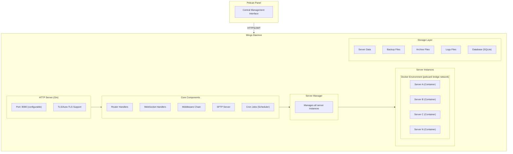

# Pelican Wings - Comprehensive Documentation

## Table of Contents

1. [Overview](#overview)
2. [Architecture](#architecture)
3. [Installation & Configuration](#installation--configuration)
4. [API Reference](#api-reference)
5. [WebSocket API](#websocket-api)
6. [SFTP Server](#sftp-server)
7. [Data Models](#data-models)
8. [Server Lifecycle](#server-lifecycle)
9. [Backup System](#backup-system)
10. [Transfer System](#transfer-system)
11. [Security](#security)
12. [Configuration Reference](#configuration-reference)
13. [CLI Commands](#cli-commands)
14. [Error Handling](#error-handling)
15. [Events System](#events-system)
16. [Development](#development)

---

## Overview

**Pelican Wings** is the server control plane daemon for the Pelican Panel project. It provides a high-performance, secure HTTP API for programmatic control over game server instances running in Docker containers. Wings also includes a built-in SFTP server for file management.

### Key Features

- RESTful HTTP API for server management
- Real-time WebSocket connections for console output and events
- Built-in SFTP server with Panel authentication
- Docker container management
- Automated backup creation and restoration
- Server-to-server transfer capabilities
- Crash detection and automatic recovery
- File management with quota enforcement

### Technical Stack

- **Language**: Go 1.24.0
- **HTTP Framework**: Gin (v1.10.1)
- **WebSocket**: Gorilla WebSocket (v1.5.3)
- **Database**: SQLite + GORM (v1.30.3)
- **Container Runtime**: Docker SDK (v28.5.1)
- **CLI Framework**: Cobra (v1.10.1)
- **License**: MIT

---

## Architecture

### System Architecture Diagram



### Package Structure

| Package        | Purpose                                                              |
| -------------- | -------------------------------------------------------------------- |
| `cmd/`         | CLI command handlers (root, configure, diagnostics, selfupdate)      |
| `config/`      | Configuration management (singleton pattern with thread-safe access) |
| `server/`      | Server instance management, lifecycle, filesystem, backup operations |
| `router/`      | HTTP API routes, handlers, middleware, WebSocket, token management   |
| `environment/` | Docker environment abstraction and container management              |
| `remote/`      | Panel API client for communication with Pelican Panel                |
| `sftp/`        | Built-in SFTP server implementation                                  |
| `events/`      | Event bus system for real-time updates                               |
| `internal/`    | Internal utilities (database, models, cron jobs, diagnostics)        |
| `parser/`      | Configuration file parsing (INI, YAML, JSON)                         |
| `system/`      | System utilities and version information                             |

---

## Installation & Configuration

### System Requirements

- Linux (AMD64 or ARM64)
- Docker Engine (20.10+)
- Minimum 1GB RAM
- Network access to Pelican Panel

### Installation

```bash
# Download the latest release
curl -L https://github.com/pelican-dev/wings/releases/latest/download/wings_linux_amd64 -o /usr/local/bin/wings
chmod +x /usr/local/bin/wings

# Create configuration directory
mkdir -p /etc/pelican

# Configure Wings (interactive)
wings configure

# Or copy configuration from Panel
# Place config.yml in /etc/pelican/config.yml
```

### Systemd Service

```ini
[Unit]
Description=Pelican Wings Daemon
After=docker.service
Requires=docker.service
PartOf=docker.service

[Service]
User=root
WorkingDirectory=/etc/pelican
LimitNOFILE=4096
PIDFile=/var/run/wings/daemon.pid
ExecStart=/usr/local/bin/wings
Restart=on-failure
StartLimitInterval=180
StartLimitBurst=30
RestartSec=5s

[Install]
WantedBy=multi-user.target
```

### Directory Structure

| Path                        | Purpose                 | Default                    |
| --------------------------- | ----------------------- | -------------------------- |
| `/etc/pelican/config.yml`   | Main configuration file | Required                   |
| `/var/lib/pelican`          | Root data directory     | `system.root_directory`    |
| `/var/lib/pelican/volumes`  | Server data files       | `system.data`              |
| `/var/lib/pelican/backups`  | Local backup storage    | `system.backup_directory`  |
| `/var/lib/pelican/archives` | Transfer archives       | `system.archive_directory` |
| `/var/log/pelican`          | Log files               | `system.log_directory`     |
| `/tmp/pelican`              | Temporary files         | `system.tmp_directory`     |

---

## API Reference

### Authentication

All protected API endpoints require Bearer token authentication:

```
Authorization: Bearer <token>
```

The token is configured in `/etc/pelican/config.yml` and must match the token stored in the Panel.

### Response Format

**Success Response:**

```json
{
  "data": { ... }
}
```

**Error Response:**

```json
{
  "error": "Human-readable error message",
  "request_id": "uuid-for-tracking"
}
```

### HTTP Status Codes

| Code | Meaning                                 |
| ---- | --------------------------------------- |
| 200  | Success                                 |
| 202  | Accepted (async processing)             |
| 204  | No Content (success, no body)           |
| 400  | Bad Request                             |
| 401  | Unauthorized (missing token)            |
| 403  | Forbidden (invalid token)               |
| 404  | Not Found                               |
| 409  | Conflict                                |
| 422  | Unprocessable Entity (validation error) |
| 500  | Internal Server Error                   |
| 502  | Bad Gateway (server not running)        |

---

### System Endpoints

#### GET /api/system

Get system information.

**Authentication:** Required

**Query Parameters:**
| Parameter | Type | Description |
|-----------|------|-------------|
| `v` | string | API version (v=2 for extended info) |

**Response (v1):**

```json
{
  "architecture": "amd64",
  "cpu_count": 4,
  "kernel_version": "5.15.0-generic",
  "os": "linux",
  "version": "1.11.11"
}
```

---

#### GET /api/system/utilization

Get system resource utilization.

**Authentication:** Required

**Response:**

```json
{
  "cpu": {
    "cores": 4,
    "usage": 25.5
  },
  "memory": {
    "total": 8589934592,
    "used": 4294967296,
    "available": 4294967296
  },
  "disk": {
    "root": { "total": 107374182400, "used": 53687091200 },
    "data": { "total": 107374182400, "used": 21474836480 },
    "backups": { "total": 107374182400, "used": 10737418240 }
  }
}
```

---

#### GET /api/system/docker/disk

Get Docker disk usage statistics.

**Authentication:** Required

**Response:** Docker disk usage object from Docker API.

---

#### DELETE /api/system/docker/image/prune

Prune unused Docker images.

**Authentication:** Required

**Response:** Docker image prune results.

---

#### GET /api/system/ips

Get all system IP addresses.

**Authentication:** Required

**Response:**

```json
{
  "ip_addresses": ["10.0.0.1", "192.168.1.1", "172.17.0.1"]
}
```

---

#### GET /api/diagnostics

Get system diagnostic information.

**Authentication:** Required

**Query Parameters:**
| Parameter | Type | Default | Description |
|-----------|------|---------|-------------|
| `include_endpoints` | bool | false | Include endpoint data |
| `include_logs` | bool | true | Include log output |
| `log_lines` | int | 200 | Number of log lines (max 500) |

**Response:** Plain text diagnostic report.

---

#### POST /api/update

Update Wings configuration from Panel.

**Authentication:** Required

**Request Body:** Full configuration object (JSON)

**Response:**

```json
{
  "applied": true
}
```

**Note:** Ignored if `ignore_panel_config_updates` is enabled.

---

### Server Management Endpoints

#### GET /api/servers

List all servers on this node.

**Authentication:** Required

**Response:**

```json
[
  {
    "uuid": "abc123-def456",
    "name": "My Server",
    "state": "running",
    "is_suspended": false,
    "resources": {
      "memory_bytes": 1073741824,
      "disk_bytes": 5368709120,
      "cpu_absolute": 25.5,
      "network_rx_bytes": 1048576,
      "network_tx_bytes": 524288
    }
  }
]
```

---

#### POST /api/servers

Create a new server.

**Authentication:** Required

**Request Body:**

```json
{
  "uuid": "abc123-def456",
  "start_on_completion": true
}
```

**Response:** 202 Accepted

Server creation happens asynchronously in the background.

---

#### GET /api/servers/:server

Get server details.

**Authentication:** Required

**Path Parameters:**
| Parameter | Type | Description |
|-----------|------|-------------|
| `server` | string | Server UUID |

**Response:**

```json
{
  "uuid": "abc123-def456",
  "name": "My Server",
  "state": "running",
  "is_suspended": false,
  "is_installing": false,
  "is_transferring": false,
  "resources": {
    "memory_bytes": 1073741824,
    "memory_limit_bytes": 2147483648,
    "disk_bytes": 5368709120,
    "cpu_absolute": 25.5,
    "network_rx_bytes": 1048576,
    "network_tx_bytes": 524288,
    "uptime": 3600000
  },
  "configuration": {
    "uuid": "abc123-def456",
    "name": "My Server",
    "invocation": "java -Xms128M -Xmx{{SERVER_MEMORY}}M -jar server.jar",
    "allocations": {
      "default": {
        "ip": "0.0.0.0",
        "port": 25565
      },
      "mappings": {
        "0.0.0.0": [25565, 25566]
      }
    },
    "build": {
      "memory_limit": 2048,
      "swap": 0,
      "io_weight": 500,
      "cpu_limit": 200,
      "disk_space": 10240,
      "threads": null,
      "oom_killer": true
    }
  }
}
```

---

#### DELETE /api/servers/:server

Delete a server.

**Authentication:** Required

**Path Parameters:**
| Parameter | Type | Description |
|-----------|------|-------------|
| `server` | string | Server UUID |

**Response:** 204 No Content

**Effects:**

- Suspends server immediately
- Stops container
- Removes server files
- Optionally removes backups (configurable)
- Removes from manager

---

#### GET /api/servers/:server/logs

Get server console logs.

**Authentication:** Required

**Path Parameters:**
| Parameter | Type | Description |
|-----------|------|-------------|
| `server` | string | Server UUID |

**Query Parameters:**
| Parameter | Type | Default | Description |
|-----------|------|---------|-------------|
| `size` | int | 100 | Number of lines (max 100) |

**Response:**

```json
{
  "data": "[2024-01-15 10:30:00] Server started\n[2024-01-15 10:30:01] Loading world..."
}
```

---

#### GET /api/servers/:server/install-logs

Get server installation logs.

**Authentication:** Required

**Response:**

```json
{
  "data": "Installation log content..."
}
```

---

#### POST /api/servers/:server/power

Control server power state.

**Authentication:** Required

**Request Body:**

```json
{
  "action": "start",
  "wait_seconds": 30
}
```

**Actions:**
| Action | Description |
|--------|-------------|
| `start` | Start the server |
| `stop` | Graceful shutdown |
| `restart` | Restart the server |
| `kill` | Force terminate |

**Response:** 202 Accepted

**Errors:**

- 400: Server is suspended
- 422: Invalid action

---

#### POST /api/servers/:server/commands

Send console command.

**Authentication:** Required

**Request Body:**

```json
{
  "commands": ["say Hello World", "list"]
}
```

**Response:** 204 No Content

**Errors:**

- 502: Server not running

---

#### POST /api/servers/:server/install

Execute server installation.

**Authentication:** Required

**Response:** 202 Accepted

Installation runs asynchronously.

---

#### POST /api/servers/:server/reinstall

Reinstall the server.

**Authentication:** Required

**Response:** 202 Accepted

**Errors:**

- 409: Another power action is running

---

#### POST /api/servers/:server/sync

Sync server configuration with Panel.

**Authentication:** Required

**Response:** 204 No Content

---

#### POST /api/deauthorize-user

Revoke user access across servers.

**Authentication:** Required

**Request Body:**

```json
{
  "user": "user-uuid",
  "servers": ["server-uuid-1", "server-uuid-2"]
}
```

If `servers` is empty, revokes for all servers.

**Response:** 204 No Content

**Effects:**

- Cancels WebSocket connections
- Cancels SFTP connections
- Adds user tokens to deny list

---

### Server Events & Console Endpoints

#### GET /api/events

Stream real-time SSE (Server-Sent Events) for one or more servers. Events include console output, state changes, and resource statistics.

**Authentication:** Required

**Query Parameters:**
| Parameter | Type | Description |
|-----------|------|-------------|
| `servers` | string | Comma-separated server UUIDs (required) |

**SSE Headers Sent:**

```
Content-Type: text/event-stream
Cache-Control: no-cache
Connection: keep-alive
X-Accel-Buffering: no
```

**Event Types:**

| Event | Payload | Description |
|-------|---------|-------------|
| `status` | `sseStatusData` | Server state changed |
| `stats` | `sseStatsData` | Resource usage update |
| `console output` | `sseConsoleData` | Console output line |

**Wire Format:**

```
event: status
data: {"server_id":"abc123-def456","state":"running"}

event: stats
data: {"server_id":"abc123-def456","memory_bytes":1073741824,"memory_limit_bytes":2147483648,"cpu_absolute":45.2,"network":{"rx_bytes":1024,"tx_bytes":2048},"uptime":360000,"state":"running","disk_bytes":5368709120}

event: console output
data: {"server_id":"abc123-def456","line":"[21:30:15 INFO]: Player joined the game"}

: keepalive
```

**Payload Schemas:**

`status` event:
```json
{
  "server_id": "abc123-def456",
  "state": "running"
}
```

`stats` event:
```json
{
  "server_id": "abc123-def456",
  "memory_bytes": 1073741824,
  "memory_limit_bytes": 2147483648,
  "cpu_absolute": 45.2,
  "network": {
    "rx_bytes": 1024,
    "tx_bytes": 2048
  },
  "uptime": 360000,
  "state": "running",
  "disk_bytes": 5368709120
}
```

`console output` event:
```json
{
  "server_id": "abc123-def456",
  "line": "[21:30:15 INFO]: Player joined the game"
}
```

**Behavior:**

- On connect, sends initial `status` and `stats` events for each requested server.
- A keepalive comment (`: keepalive`) is sent every 15 seconds to prevent proxy timeouts.
- If a server is deleted mid-stream, a `status` event with `"state": "deleted"` is sent for that server.
- The connection stays open until the client disconnects.

**Errors:**

- 400: Missing or empty `servers` parameter
- 404: One or more server UUIDs not found

---

#### GET /api/servers/:server/console

Get recent console log history for a single server.

**Authentication:** Required

**Path Parameters:**
| Parameter | Type | Description |
|-----------|------|-------------|
| `server` | string | Server UUID |

**Query Parameters:**
| Parameter | Type | Default | Description |
|-----------|------|---------|-------------|
| `size` | int | 100 | Number of lines (1-100) |

**Response:**

```json
{
  "state": "running",
  "line_count": 3,
  "lines": [
    "[21:30:10 INFO]: Server started",
    "[21:30:12 INFO]: Loading world...",
    "[21:30:15 INFO]: Player joined the game"
  ]
}
```

---

### File Management Endpoints

#### GET /api/servers/:server/files/contents

Read file contents.

**Authentication:** Required

**Query Parameters:**
| Parameter | Type | Description |
|-----------|------|-------------|
| `file` | string | File path (required) |
| `download` | string | If present, returns as attachment |

**Response Headers:**

```
X-Mime-Type: text/plain
Content-Length: 1234
Content-Disposition: attachment; filename="config.yml"
```

**Response:** Raw file content

**Errors:**

- 404: File not found
- 400: File is a directory or named pipe

---

#### GET /api/servers/:server/files/list-directory

List directory contents.

**Authentication:** Required

**Query Parameters:**
| Parameter | Type | Description |
|-----------|------|-------------|
| `directory` | string | Directory path (required) |

**Response:**

```json
[
  {
    "name": "server.jar",
    "mode": "-rw-r--r--",
    "mode_bits": "0644",
    "size": 45678912,
    "is_file": true,
    "is_symlink": false,
    "mimetype": "application/java-archive",
    "created_at": "2024-01-15T10:30:00Z",
    "modified_at": "2024-01-15T10:30:00Z"
  },
  {
    "name": "world",
    "mode": "drwxr-xr-x",
    "mode_bits": "0755",
    "size": 4096,
    "is_file": false,
    "is_symlink": false,
    "mimetype": "inode/directory",
    "created_at": "2024-01-15T10:30:00Z",
    "modified_at": "2024-01-15T10:30:00Z"
  }
]
```

---

#### POST /api/servers/:server/files/write

Write file contents.

**Authentication:** Required

**Query Parameters:**
| Parameter | Type | Description |
|-----------|------|-------------|
| `file` | string | File path (required) |

**Request Headers:**

```
Content-Length: 1234
```

**Request Body:** Raw file content

**Response:** 204 No Content

---

#### PUT /api/servers/:server/files/rename

Rename/move files.

**Authentication:** Required

**Request Body:**

```json
{
  "root": "/",
  "files": [
    {
      "from": "old-name.txt",
      "to": "new-name.txt"
    }
  ]
}
```

**Response:** 204 No Content

**Errors:**

- 422: No files provided
- 400: Destination exists

---

#### POST /api/servers/:server/files/copy

Copy a file.

**Authentication:** Required

**Request Body:**

```json
{
  "location": "/path/to/file.txt"
}
```

**Response:** 204 No Content

Creates a copy with "\_copy" suffix.

---

#### POST /api/servers/:server/files/delete

Delete files/directories.

**Authentication:** Required

**Request Body:**

```json
{
  "root": "/",
  "files": ["file1.txt", "folder1"]
}
```

**Response:** 204 No Content

---

#### POST /api/servers/:server/files/create-directory

Create a directory.

**Authentication:** Required

**Request Body:**

```json
{
  "name": "new-folder",
  "path": "/parent/path"
}
```

**Response:** 204 No Content

---

#### POST /api/servers/:server/files/compress

Compress files into an archive.

**Authentication:** Required

**Request Body:**

```json
{
  "root": "/",
  "files": ["file1.txt", "folder1"],
  "name": "archive",
  "extension": "tar.gz"
}
```

**Supported Extensions:**

- `zip`
- `tar.gz`
- `tar.bz2`
- `tar.xz`

**Response:** File stat object of the created archive

**Errors:**

- 409: Insufficient disk space

---

#### POST /api/servers/:server/files/decompress

Extract an archive.

**Authentication:** Required

**Request Body:**

```json
{
  "root": "/extract/to",
  "file": "/path/to/archive.tar.gz"
}
```

**Response:** 204 No Content

Supported formats: tar, tar.gz, tar.bz2, tar.xz, zip

---

#### POST /api/servers/:server/files/chmod

Change file permissions.

**Authentication:** Required

**Request Body:**

```json
{
  "root": "/",
  "files": [
    {
      "file": "script.sh",
      "mode": "0755"
    }
  ]
}
```

**Response:** 204 No Content

---

#### GET /api/servers/:server/files/search

Search for files.

**Authentication:** Required

**Query Parameters:**
| Parameter | Type | Description |
|-----------|------|-------------|
| `directory` | string | Root directory (required) |
| `pattern` | string | Search pattern, min 3 chars (required) |

**Pattern Syntax:**

- `*` - Wildcard (any characters)
- `?` - Single character
- `.js` - File extension
- Substring matching (case-insensitive)

**Response:**

```json
[
  {
    "name": "config.json",
    "path": "/plugins/config.json"
  }
]
```

**Blacklisted Directories:** node_modules, .git, .wine, appcache, depotcache, vendor

---

#### GET /api/servers/:server/files/pull

List in-progress remote downloads.

**Authentication:** Required

**Middleware:** RemoteDownloadEnabled (checks `api.disable_remote_download`)

**Response:**

```json
[
  {
    "identifier": "download-uuid",
    "url": "https://example.com/file.zip",
    "progress": 45.5
  }
]
```

---

#### POST /api/servers/:server/files/pull

Start remote file download.

**Authentication:** Required

**Middleware:** RemoteDownloadEnabled

**Request Body:**

```json
{
  "url": "https://example.com/file.zip",
  "root": "/download/to",
  "file_name": "custom_name.zip",
  "use_header": false,
  "foreground": false
}
```

**Response (background):** 202 Accepted

```json
{
  "identifier": "download-uuid"
}
```

**Response (foreground):** 200 with file stats

**Limits:** Max 3 concurrent downloads per server

---

#### DELETE /api/servers/:server/files/pull/:download

Cancel remote download.

**Authentication:** Required

**Response:** 204 No Content

---

### Backup Endpoints

#### POST /api/servers/:server/backup

Create a backup.

**Authentication:** Required

**Request Body:**

```json
{
  "adapter": "wings",
  "uuid": "backup-uuid",
  "ignore": "*.log\n.git"
}
```

**Adapters:**
| Adapter | Description |
|---------|-------------|
| `wings` | Local filesystem storage |
| `s3` | S3-compatible remote storage |

**Response:** 202 Accepted

---

#### POST /api/servers/:server/backup/:backup/restore

Restore from backup.

**Authentication:** Required

**Path Parameters:**
| Parameter | Type | Description |
|-----------|------|-------------|
| `backup` | string | Backup UUID |

**Request Body:**

```json
{
  "adapter": "wings",
  "truncate_directory": true,
  "download_url": "https://s3.example.com/backup.tar.gz"
}
```

`download_url` is required for S3 adapter.

**Response:** 202 Accepted (blocks until complete)

---

#### DELETE /api/servers/:server/backup/:backup

Delete a backup.

**Authentication:** Required

**Response:** 204 No Content

---

#### DELETE /api/servers/:server/deleteAllBackups

Delete all backups for a server.

**Authentication:** Required

**Response:** 204 No Content

---

### Transfer Endpoints

#### POST /api/servers/:server/transfer

Initiate server transfer.

**Authentication:** Required

**Request Body:**

```json
{
  "url": "https://destination-wings:8080/api/transfers",
  "token": "jwt-from-panel",
  "backups": ["backup-uuid-1", "backup-uuid-2"]
}
```

**Response:** 202 Accepted

**Effects:**

- Stops server if running
- Creates archive of server files
- Includes install logs and selected backups
- Streams to destination node

---

#### DELETE /api/servers/:server/transfer

Cancel outgoing transfer.

**Authentication:** Required

**Response:** 202 Accepted

---

#### POST /api/transfers

Receive incoming transfer.

**Authentication:** JWT in Authorization header (issued by Panel)

**Request Body:** multipart/form-data

- `archive`: Server files archive
- `checksum_archive`: SHA256 checksum
- `install_logs`: Installation logs
- `backup_*`: Backup files
- `checksum_backup_*`: Backup checksums

**Response:** 200 OK

---

#### DELETE /api/transfers/:server

Cancel incoming transfer.

**Authentication:** Required

**Response:** 202 Accepted

---

### Download/Upload Endpoints

#### GET /download/file

Download a server file.

**Authentication:** Signed token in query parameter

**Query Parameters:**
| Parameter | Type | Description |
|-----------|------|-------------|
| `token` | string | Signed download token |

**Response:** Binary file stream

**Headers:**

```
Content-Length: 1234567
Content-Disposition: attachment; filename="server.jar"
Content-Type: application/octet-stream
```

---

#### GET /download/backup

Download a backup file.

**Authentication:** Signed token in query parameter

**Query Parameters:**
| Parameter | Type | Description |
|-----------|------|-------------|
| `token` | string | Signed backup token |

**Response:** Binary file stream

---

#### POST /upload/file

Upload files to server.

**Authentication:** Signed token in query parameter

**Query Parameters:**
| Parameter | Type | Description |
|-----------|------|-------------|
| `token` | string | Signed upload token |
| `directory` | string | Target directory |

**Request Body:** multipart/form-data with `files` field

**Response:** 200 OK

**Limits:** `api.upload_limit` (default 100 MiB per file)

---

## WebSocket API

### Connection

```
GET /api/servers/:server/ws
```

**Authentication:** JWT token in Authorization header or query parameter

**Protocol:** WebSocket (RFC 6455)

**Connection Limits:** 30 concurrent connections per server

### Authentication Flow

1. Client connects to WebSocket endpoint
2. Server sends `{"event": "auth", "args": []}`
3. Client sends `{"event": "auth", "args": ["<JWT>"]}`
4. Server validates JWT and responds with `{"event": "auth success"}`
5. Server sends console output history

### Message Format

```json
{
  "event": "event-name",
  "args": ["arg1", "arg2"]
}
```

### Client Events (Inbound)

| Event          | Args          | Rate Limit | Description                                    |
| -------------- | ------------- | ---------- | ---------------------------------------------- |
| `auth`         | `[jwt_token]` | 2/5s       | Authenticate connection                        |
| `send logs`    | `[]`          | 2/5s       | Request console log history                    |
| `send command` | `[command]`   | 10/1s      | Send console command                           |
| `set state`    | `[action]`    | 4/1s       | Request power action (start/stop/restart/kill) |

### Server Events (Outbound)

| Event                      | Args        | Description                                              |
| -------------------------- | ----------- | -------------------------------------------------------- |
| `auth success`             | `[]`        | Authentication succeeded                                 |
| `auth`                     | `[]`        | Authentication required                                  |
| `token expiring`           | `[]`        | JWT about to expire                                      |
| `token expired`            | `[]`        | JWT expired                                              |
| `console output`           | `[line]`    | Console output line                                      |
| `status`                   | `[state]`   | Server state changed (offline/starting/running/stopping) |
| `stats`                    | `[json]`    | Resource usage stats                                     |
| `daemon message`           | `[message]` | Daemon notification                                      |
| `daemon error`             | `[error]`   | Daemon error message                                     |
| `install output`           | `[line]`    | Installation output (requires permission)                |
| `install started`          | `[]`        | Installation started                                     |
| `install completed`        | `[]`        | Installation completed                                   |
| `backup completed`         | `[json]`    | Backup completed                                         |
| `backup restore completed` | `[]`        | Backup restore completed                                 |
| `transfer logs`            | `[line]`    | Transfer output                                          |
| `transfer status`          | `[status]`  | Transfer status update                                   |

### Permissions

JWT must include appropriate permissions:

| Permission                 | Grants                  |
| -------------------------- | ----------------------- |
| `websocket.connect`        | Basic connection        |
| `control.console`          | Send commands           |
| `control.start`            | Start server            |
| `control.stop`             | Stop server             |
| `control.restart`          | Restart server          |
| `admin.websocket.errors`   | Receive error events    |
| `admin.websocket.install`  | Receive install events  |
| `admin.websocket.transfer` | Receive transfer events |
| `backup.read`              | Receive backup events   |

### Rate Limiting

| Category       | Limit                             |
| -------------- | --------------------------------- |
| Global         | 50 messages per 200ms (burst: 10) |
| Authentication | 2 per 5 seconds                   |
| Log requests   | 2 per 5 seconds                   |
| Commands       | 10 per 1 second                   |
| State changes  | 4 per 1 second                    |
| Default        | 4 per 1 second                    |

---

## SFTP Server

Wings includes a built-in SFTP server for file management.

### Configuration

```yaml
system:
  sftp:
    bind_address: 0.0.0.0
    bind_port: 2022
    read_only: false
    key_only: false
```

### Authentication

SFTP authentication uses the Panel API. Username format:

```
<username>.<server_uuid_first_8_chars>
```

Example: `admin.abc12345`

### Features

- Full file operations (read, write, delete, rename, chmod)
- Directory operations (list, create, remove)
- Symbolic link support
- Activity logging
- Session management
- Read-only mode support
- Key-only authentication option

### Security

- ED25519 SSH keys (auto-generated)
- Modern cipher suites:
  - AES-GCM
  - ChaCha20-Poly1305
  - AES-CTR
- Key exchange: curve25519-sha256, ECDH variants
- Standard SSH MAC algorithms

---

## Data Models

### Server

```go
type Server struct {
    UUID           string           // Unique identifier
    Name           string           // Display name
    State          string           // Current state
    IsSuspended    bool             // Suspension status
    Configuration  Configuration    // Server configuration
    Environment    Environment      // Docker environment
    Filesystem     Filesystem       // File system access
    Resources      ResourceUsage    // Current resource usage
    CrashHandler   CrashHandler     // Crash detection
}
```

### Server States

| State      | Description             |
| ---------- | ----------------------- |
| `offline`  | Server is not running   |
| `starting` | Server is booting       |
| `running`  | Server is operational   |
| `stopping` | Server is shutting down |

### Configuration

```go
type Configuration struct {
    UUID              string
    Name              string
    Description       string
    Suspended         bool
    Invocation        string            // Startup command
    EnvVars           map[string]string // Environment variables
    Labels            map[string]string // Container labels
    Allocations       Allocations       // IP/Port mappings
    Build             BuildSettings     // Resource limits
    CrashDetection    CrashSettings     // Crash detection config
    Mounts            []Mount           // Volume mounts
    Egg               EggConfiguration  // Egg settings
}
```

### Build Settings

```go
type BuildSettings struct {
    MemoryLimit  int64  // Memory limit in MiB
    Swap         int64  // Swap limit in MiB
    IoWeight     int    // Block I/O weight (10-1000)
    CpuLimit     int    // CPU limit percentage (100 = 1 core)
    DiskSpace    int64  // Disk limit in MiB
    Threads      string // CPU pinning
    OomKiller    bool   // OOM killer enabled
}
```

### Allocations

```go
type Allocations struct {
    ForceOutgoingIP bool
    Default         AllocationMapping
    Mappings        map[string][]int
}

type AllocationMapping struct {
    IP   string
    Port int
}
```

### Backup

```go
type Backup struct {
    UUID       string
    ServerUUID string
    Ignore     string // Gitignore-style patterns
    Adapter    string // "wings" or "s3"
}

type ArchiveDetails struct {
    Size         int64
    Checksum     string
    ChecksumType string
}
```

### Transfer

```go
type Transfer struct {
    Status  string   // pending/processing/completed/failed/cancelled
    Archive string   // Archive path
    Backups []string // Backup UUIDs
}
```

### Activity

```go
type Activity struct {
    User      string
    Server    string
    Event     string
    Metadata  map[string]interface{}
    IP        string
    Timestamp time.Time
}
```

---

## Server Lifecycle

### State Transitions

```
                    ┌─────────────────────────────────────┐
                    │                                     │
                    ▼                                     │
┌─────────┐    ┌──────────┐    ┌─────────┐    ┌──────────┴──┐
│ offline │───▶│ starting │───▶│ running │───▶│   stopping  │
└────┬────┘    └──────────┘    └────┬────┘    └─────────────┘
     │                              │
     │         ┌────────────────────┘
     │         │ Crash Detection
     │         ▼
     │    ┌──────────┐
     └───▶│ starting │ (Auto-restart)
          └──────────┘
```

### Power Actions

| Action    | Description          | API Endpoint                    |
| --------- | -------------------- | ------------------------------- |
| `start`   | Start stopped server | POST /api/servers/:server/power |
| `stop`    | Graceful shutdown    | POST /api/servers/:server/power |
| `restart` | Stop then start      | POST /api/servers/:server/power |
| `kill`    | Force terminate      | POST /api/servers/:server/power |

### Crash Detection

Wings monitors server exits and can automatically restart crashed servers.

**Configuration:**

```yaml
system:
  crash_detection:
    enabled: true
    detect_clean_exit_as_crash: true
    timeout: 60
```

**Behavior:**

1. Server exits unexpectedly
2. If crash detection enabled and not within timeout of last crash
3. Server automatically restarts
4. If crashes too frequently, crash detection is disabled

### Installation Process

1. Panel initiates installation via API
2. Wings pulls container image
3. Installation container runs egg script
4. Installation logs are captured
5. Panel is notified of completion
6. Server optionally auto-starts

---

## Backup System

### Backup Adapters

#### Wings (Local)

Stores backups on the local filesystem.

**Storage:** `/var/lib/pelican/backups/<server-uuid>/`

**Format:** tar.gz archive

#### S3 (Remote)

Uploads backups to S3-compatible storage.

**Supported Providers:**

- Amazon S3
- MinIO
- Wasabi
- DigitalOcean Spaces
- Backblaze B2
- Any S3-compatible service

### Compression Levels

```yaml
system:
  backups:
    compression_level: best_speed
```

| Level              | Description                  |
| ------------------ | ---------------------------- |
| `none`             | No compression               |
| `best_speed`       | Gzip level 1 (fast, larger)  |
| `best_compression` | Gzip level 9 (slow, smaller) |

### Ignore Patterns

Backups support gitignore-style patterns via `.pelicanignore` file or per-backup ignore list.

**Example .pelicanignore:**

```
*.log
*.tmp
cache/
node_modules/
.git/
```

### Backup Write Limiting

```yaml
system:
  backups:
    write_limit: 0 # MiB/s, 0 = unlimited
```

### Checksum Verification

All backups include SHA1 checksums for integrity verification.

---

## Transfer System

### Transfer Process

1. **Initiation** (Source Node)
   - Panel sends transfer request
   - Server is stopped
   - Server is blocked from starting

2. **Archive Creation** (Source Node)
   - Server files are archived
   - Install logs are included
   - Selected backups are included
   - SHA256 checksums are calculated

3. **Transfer** (Source → Destination)
   - Archive streamed via HTTPS
   - JWT authentication
   - Checksums verified on receipt

4. **Reception** (Destination Node)
   - Archive extracted
   - Backups restored
   - Server registered
   - Panel notified

5. **Cleanup** (Source Node)
   - Server removed from source
   - Backups optionally removed

### Transfer Status

| Status       | Description          |
| ------------ | -------------------- |
| `pending`    | Transfer initiated   |
| `processing` | Transfer in progress |
| `completed`  | Transfer successful  |
| `failed`     | Transfer failed      |
| `cancelled`  | Transfer cancelled   |

---

## Security

### TLS Configuration

Wings supports TLS 1.2+ with modern cipher suites:

```go
CipherSuites: []uint16{
    TLS_ECDHE_ECDSA_WITH_AES_128_GCM_SHA256,
    TLS_ECDHE_ECDSA_WITH_AES_256_GCM_SHA384,
    TLS_ECDHE_RSA_WITH_AES_128_GCM_SHA256,
    TLS_ECDHE_RSA_WITH_AES_256_GCM_SHA384,
    TLS_ECDHE_RSA_WITH_CHACHA20_POLY1305_SHA256,
    TLS_ECDHE_ECDSA_WITH_CHACHA20_POLY1305_SHA256,
}
CurvePreferences: []CurveID{X25519, CurveP256}
```

### Auto-TLS (Let's Encrypt)

```bash
wings --auto-tls --tls-hostname wings.example.com
```

### Authentication Methods

| Method       | Use Case             |
| ------------ | -------------------- |
| Bearer Token | API authentication   |
| JWT          | WebSocket, transfers |
| Signed Token | File downloads       |
| Panel Auth   | SFTP authentication  |

### File System Security

- Path traversal protection
- Symbolic link validation
- Permission enforcement
- Disk quota enforcement
- Denylist patterns

### Container Isolation

- Docker container sandboxing
- Resource limits (CPU, memory, disk)
- Network isolation (pelican0 bridge)
- User namespacing (optional rootless)

---

## Configuration Reference

### Complete Configuration File

```yaml
# Application name
app_name: pelican

# Debug mode
debug: false

# Unique node identifier
uuid: <auto-generated>

# Authentication tokens
token_id: <from-panel>
token: <from-panel>

# API Configuration
api:
  host: 0.0.0.0
  port: 8080
  ssl:
    enabled: false
    cert: /etc/pelican/certs/cert.pem
    key: /etc/pelican/certs/key.pem
  upload_limit: 100 # MiB
  trusted_proxies: []
  disable_remote_download: false
  remote_download:
    max_redirects: 10

# System Configuration
system:
  root_directory: /var/lib/pelican
  log_directory: /var/log/pelican
  data: /var/lib/pelican/volumes
  archive_directory: /var/lib/pelican/archives
  backup_directory: /var/lib/pelican/backups
  tmp_directory: /tmp/pelican
  username: pelican
  timezone: UTC

  # User configuration
  user:
    uid: 988
    gid: 988
    rootless:
      enabled: false
      container_uid: 0
      container_gid: 0
    passwd:
      enable: true
      directory: /etc/pelican

  # Machine ID for specific games
  machine_id:
    enable: true
    directory: /etc/pelican/machine-id

  # Performance settings
  disk_check_interval: 150 # seconds
  activity_send_interval: 60 # seconds
  activity_send_count: 100
  check_permissions_on_boot: true
  enable_log_rotate: true
  websocket_log_count: 150

  # SFTP Configuration
  sftp:
    bind_address: 0.0.0.0
    bind_port: 2022
    read_only: false
    key_only: false

  # Crash Detection
  crash_detection:
    enabled: true
    detect_clean_exit_as_crash: true
    timeout: 60 # seconds

  crash_detection_activity_lines: 2

  # Backup Configuration
  backups:
    write_limit: 0 # MiB/s, 0 = unlimited
    compression_level: best_speed # none, best_speed, best_compression
    remove_backups_on_server_delete: true

  # Transfer Configuration
  transfers:
    download_limit: 0 # MiB/s, 0 = unlimited

  openat_mode: auto # auto, openat, openat2

# Docker Configuration
docker:
  network:
    name: pelican0
    driver: bridge
    interfaces:
      v4:
        subnet: 172.18.0.0/16
        gateway: 172.18.0.1
      v6:
        subnet: fdba:17c8:6c94::/64
        gateway: fdba:17c8:6c94::1011

# Console Throttling
throttles:
  enabled: true
  lines: 2000
  line_reset_interval: 100 # ms

# Panel Connection
remote: https://panel.example.com
remote_query:
  timeout: 30 # seconds
  boot_servers_per_page: 50
  custom_headers: {}

# Allowed host mounts
allowed_mounts: []

# File search configuration
search:
  blacklisted_dirs:
    - node_modules
    - .git
    - .wine
    - appcache
    - depotcache
    - vendor
  max_recursion_depth: 8

# Block mounting to base directory
block_base_dir_mount: true

# CORS Configuration
allowed_origins: []
allow_cors_private_network: false

# Ignore Panel config updates
ignore_panel_config_updates: false
```

### Environment Variables

| Variable         | Description                       |
| ---------------- | --------------------------------- |
| `WINGS_TOKEN_ID` | Override token ID                 |
| `WINGS_TOKEN`    | Override authentication token     |
| `WINGS_USERNAME` | Override system username (Docker) |
| `WINGS_UID`      | Override user ID (Docker)         |
| `WINGS_GID`      | Override group ID (Docker)        |
| `TZ`             | Timezone                          |

### File-based Secrets

Tokens can be loaded from files using `file://` prefix:

```yaml
token: file:///run/secrets/wings-token
```

Works with systemd's `LoadCredential`:

```yaml
token: file://${CREDENTIALS_DIRECTORY}/token
```

---

## CLI Commands

### wings

Main daemon command.

```bash
wings [flags]
```

**Flags:**
| Flag | Description |
|------|-------------|
| `--config` | Path to config file (default: /etc/pelican/config.yml) |
| `--debug` | Enable debug logging |
| `--pprof` | Enable pprof on localhost:6060 |
| `--auto-tls` | Enable Let's Encrypt auto-TLS |
| `--tls-hostname` | Hostname for auto-TLS |
| `--ignore-certificate-errors` | Skip TLS verification (dev only) |

### wings configure

Interactive configuration setup.

```bash
wings configure [flags]
```

**Flags:**
| Flag | Description |
|------|-------------|
| `--panel-url` | Panel URL |
| `--token` | Authentication token |
| `--config` | Config file path |
| `--node` | Node ID |
| `--override` | Override existing config |
| `--allow-insecure` | Allow HTTP panel URL |

### wings diagnostics

Generate diagnostic report.

```bash
wings diagnostics [flags]
```

**Flags:**
| Flag | Description |
|------|-------------|
| `--config` | Config file path |
| `--log-lines` | Number of log lines |
| `--output` | Output format (json, text) |
| `--include-endpoints` | Include endpoint data |

### wings selfupdate

Self-update Wings to latest version.

```bash
wings selfupdate [flags]
```

**Flags:**
| Flag | Description |
|------|-------------|
| `--force` | Force update even if up-to-date |
| `--release` | Specific release to install |
| `--download-only` | Download without installing |

---

## Error Handling

### Common Errors

| Error                       | Cause                      | Solution                     |
| --------------------------- | -------------------------- | ---------------------------- |
| `server is suspended`       | Server suspended in Panel  | Unsuspend in Panel           |
| `server is already running` | Power action while running | Stop server first            |
| `server is installing`      | Action during installation | Wait for install             |
| `server is transferring`    | Action during transfer     | Wait for transfer            |
| `insufficient disk space`   | Disk quota exceeded        | Free space or increase quota |
| `file not found`            | Invalid file path          | Check path exists            |
| `permission denied`         | File permission issue      | Check file permissions       |

### Error Response Format

```json
{
  "error": "Human-readable error message",
  "request_id": "550e8400-e29b-41d4-a716-446655440000"
}
```

### Logging

Wings uses structured logging with rotation:

```
/var/log/pelican/wings.log
```

Log rotation is configured automatically via logrotate.

---

## Events System

### Event Bus

Wings uses a topic-based event bus for real-time updates.

### Event Topics

| Topic                      | Description            |
| -------------------------- | ---------------------- |
| `console output`           | Server console lines   |
| `status`                   | Server state changes   |
| `stats`                    | Resource usage updates |
| `daemon message`           | Daemon notifications   |
| `daemon error`             | Daemon errors          |
| `install output`           | Installation output    |
| `install started`          | Installation began     |
| `install completed`        | Installation finished  |
| `backup completed`         | Backup finished        |
| `backup restore completed` | Restore finished       |
| `transfer logs`            | Transfer output        |
| `transfer status`          | Transfer state changes |

### Event Namespacing

Events can be namespaced for filtering:

```
backup completed:<backup-uuid>
transfer status:<server-uuid>
```

---

## Development

### Building from Source

```bash
# Clone repository
git clone https://github.com/pelican-dev/wings.git
cd wings

# Build
go build -o wings

# Build with version info
go build -ldflags "-s -w -X github.com/pelican-dev/wings/system.Version=$(git describe --tags)" -o wings
```

### Running Tests

```bash
# Run all tests
go test ./...

# Run with race detection
go test -race ./...

# Run specific package
go test ./server/...
```

### Docker Development

```dockerfile
FROM golang:1.24-alpine AS builder
WORKDIR /app
COPY . .
RUN go build -o wings

FROM gcr.io/distroless/static
COPY --from=builder /app/wings /wings
ENTRYPOINT ["/wings"]
```

### Project Dependencies

Key dependencies:

- `github.com/gin-gonic/gin` - HTTP framework
- `github.com/gorilla/websocket` - WebSocket support
- `github.com/docker/docker` - Docker SDK
- `gorm.io/gorm` - ORM
- `github.com/spf13/cobra` - CLI framework
- `github.com/apex/log` - Structured logging
- `github.com/pkg/sftp` - SFTP server
- `github.com/mholt/archives` - Archive handling

---

## Appendix

### API Quick Reference

| Method | Endpoint                                    | Description       |
| ------ | ------------------------------------------- | ----------------- |
| GET    | /api/system                                 | System info       |
| GET    | /api/system/utilization                     | Resource usage    |
| GET    | /api/system/docker/disk                     | Docker disk usage |
| DELETE | /api/system/docker/image/prune              | Prune images      |
| GET    | /api/system/ips                             | System IPs        |
| GET    | /api/diagnostics                            | Diagnostics       |
| POST   | /api/update                                 | Update config     |
| GET    | /api/servers                                | List servers      |
| POST   | /api/servers                                | Create server     |
| GET    | /api/servers/:server                        | Server details    |
| DELETE | /api/servers/:server                        | Delete server     |
| GET    | /api/servers/:server/console                | Console history   |
| GET    | /api/servers/:server/logs                   | Console logs      |
| GET    | /api/servers/:server/install-logs           | Install logs      |
| POST   | /api/servers/:server/power                  | Power action      |
| POST   | /api/servers/:server/commands               | Send command      |
| POST   | /api/servers/:server/install                | Install           |
| POST   | /api/servers/:server/reinstall              | Reinstall         |
| POST   | /api/servers/:server/sync                   | Sync config       |
| GET    | /api/servers/:server/ws                     | WebSocket         |
| GET    | /api/servers/:server/files/contents         | Read file         |
| GET    | /api/servers/:server/files/list-directory   | List dir          |
| PUT    | /api/servers/:server/files/rename           | Rename            |
| POST   | /api/servers/:server/files/copy             | Copy              |
| POST   | /api/servers/:server/files/write            | Write             |
| POST   | /api/servers/:server/files/create-directory | Create dir        |
| POST   | /api/servers/:server/files/delete           | Delete            |
| POST   | /api/servers/:server/files/compress         | Compress          |
| POST   | /api/servers/:server/files/decompress       | Decompress        |
| POST   | /api/servers/:server/files/chmod            | Chmod             |
| GET    | /api/servers/:server/files/search           | Search            |
| GET    | /api/servers/:server/files/pull             | List downloads    |
| POST   | /api/servers/:server/files/pull             | Start download    |
| DELETE | /api/servers/:server/files/pull/:download   | Cancel download   |
| POST   | /api/servers/:server/backup                 | Create backup     |
| POST   | /api/servers/:server/backup/:backup/restore | Restore           |
| DELETE | /api/servers/:server/backup/:backup         | Delete backup     |
| DELETE | /api/servers/:server/deleteAllBackups       | Delete all        |
| POST   | /api/servers/:server/transfer               | Start transfer    |
| DELETE | /api/servers/:server/transfer               | Cancel transfer   |
| POST   | /api/transfers                              | Receive transfer  |
| DELETE | /api/transfers/:server                      | Cancel incoming   |
| GET    | /api/events                                 | SSE event stream  |
| POST   | /api/deauthorize-user                       | Revoke user       |
| GET    | /download/file                              | Download file     |
| GET    | /download/backup                            | Download backup   |
| POST   | /upload/file                                | Upload file       |

---

_Documentation generated for Pelican Wings. For the latest updates, visit [pelican.dev](https://pelican.dev)._
